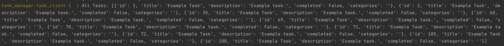
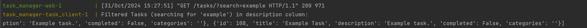
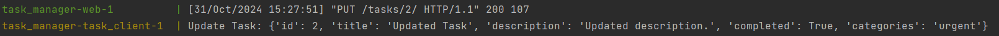
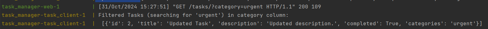
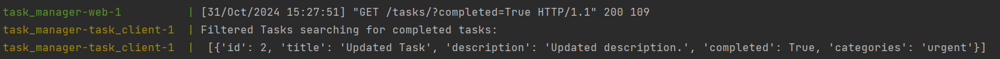
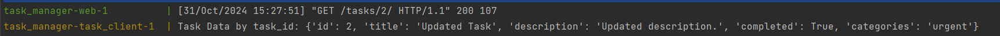
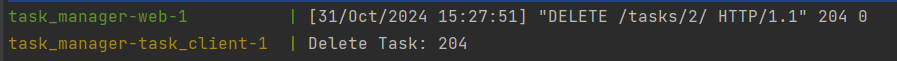

# Task Management Application

### Overview
This project is a simple web application for task management. It allows users to perform essential CRUD operations on tasks, filter them by various parameters, and manage a to-do list in a structured way.

The application consists of three main components:
1. **Database** - Stores task data persistently.
2. **API** - Provides endpoints for interacting with the task data.
3. **Script Interface** - Simulates a basic user interface for managing tasks.

<br>

### Getting Started
To set up and run the project, use the following command:

    ```
    docker-compose up
    ```

<br>

## Results


### Get the all tasks


### Filtered tasks by some term - like  "example"


### Update task


### Filtered tasks by category


### Filtered completed tasks


### Get task by id


### Delete Task


